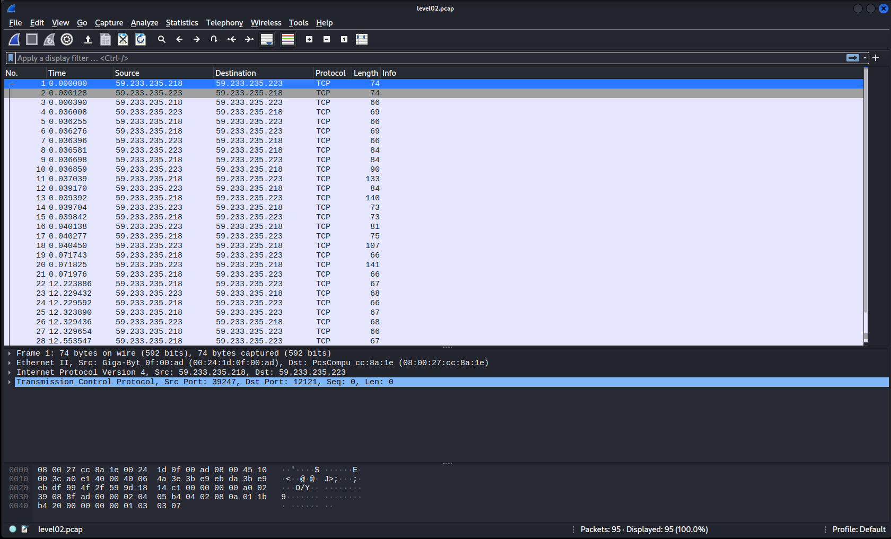
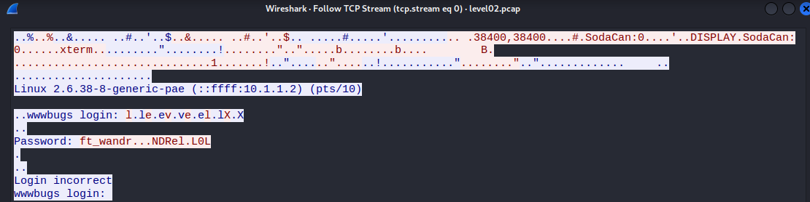
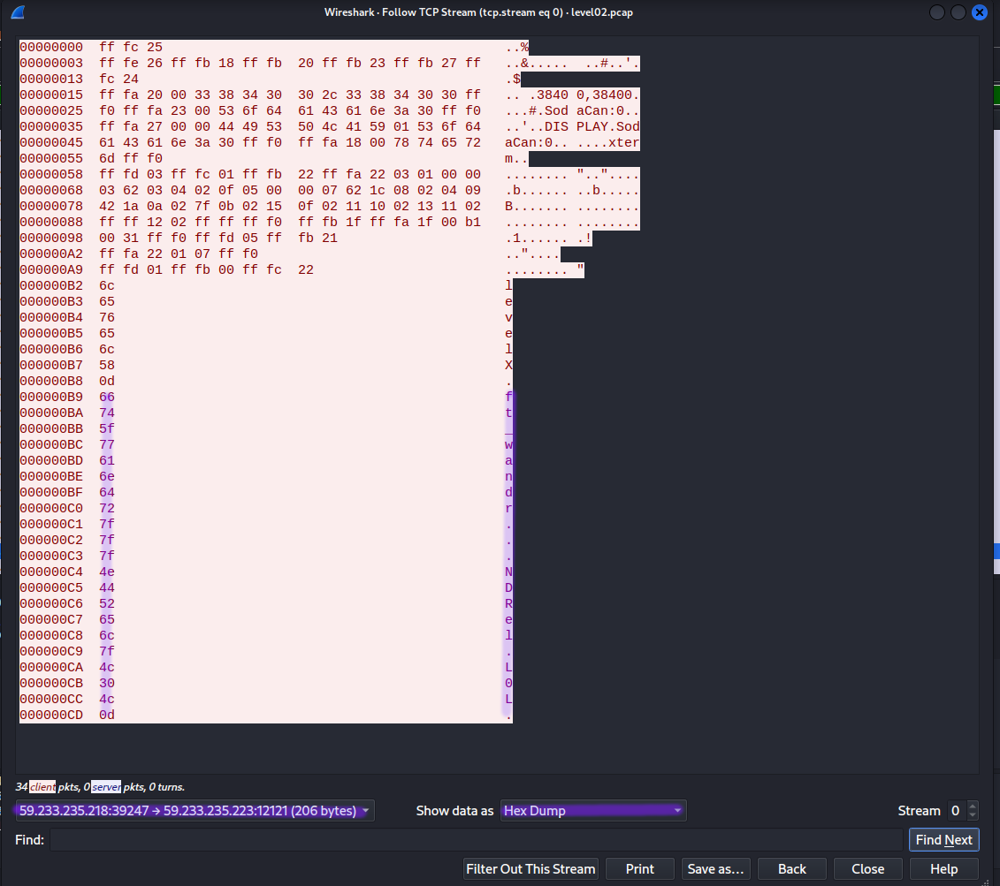

# Level02

Luckly we can find a `level02.pcap` file in `level02` user's home directory. This looks like a **forensics challenge**.

## Packet capture files (PCAP)
**Packet capture files** are files used to **store and analyse** packet transmission on a network. A useful software for generating and analysing such files is **Wireshark**.

First we need to save the file over **SSH** on our machine with the `scp` tool. The `-P <port>` option is used to specyfy the port. The two other arguments are **source** and **destination**.

If either of the source or destination is remote, the path must be prefixed with `<username>@<host>:` .

```
┌──(kali㉿kali)-[~]
└─$ scp -P 4242 level02@192.168.122.104:/home/user/level02/level02.pcap ./level02.pcap
           _____                      _____               _     
          / ____|                    / ____|             | |    
         | (___  _ __   _____      _| |     _ __ __ _ ___| |__  
          \___ \| '_ \ / _ \ \ /\ / / |    | '__/ _` / __| '_ \ 
          ____) | | | | (_) \ V  V /| |____| | | (_| \__ \ | | |
         |_____/|_| |_|\___/ \_/\_/  \_____|_|  \__,_|___/_| |_|
                                                        
  Good luck & Have fun

          
level02@192.168.122.104's password: 
level02.pcap                                                      100% 8302     4.8MB/s   00:00
```

## Analysis with Wireshark
When opening the file, we can notice that there are two IP addresses `59.233.235.218` and `59.233.235.223`.



To see a bit more clearly what is happening, we can right click on the packet list and choose **Follow > TCP Stream** from the contextual menu. This will show us the data flow between the IP's.



It seems that at a certain point, a **password is prompted** for login in **blue** and the password `ft_wandr...NDRel.L0L` is typed in **red** by the user. By default the stream is shown in **ASCII** characters and the bytes wich are not printable are represented by dots.

Let's try to filter out the user's input and transform those bytes in hex format to know their value. This can be done by selecting the **client's IP** towards the **server's IP** in the dropdown menu on the bottom left and choosing `HEX Dump` in the `Show data as:` feild.

When comparing the bytes represented by dots against the **ASCII** table, we can find out that `7f` represents the `DEL` character and `0d` represents the `CR` carriage return character.



We have deducted that the password entered and is submited by the `CR` character. The password has been entered wrongly and the user as pressed the `DEL` key several times to correct it.

This gives us the sequence of `ft_wandr[DEL][DEL][DEL]NDRel[DEL]0L[CR]` wich translates to `ft_waNDReL0L` . If we try to log in as the `flag02` user with this password, the access is granted and we are able to launch the `getflag` command.

```
level00@SnowCrash:~$ su flag02
Password: 
Don't forget to launch getflag !
flag02@SnowCrash:~$ getflag
Check flag.Here is your token : kooda2puivaav1idi4f57q8iq
```
